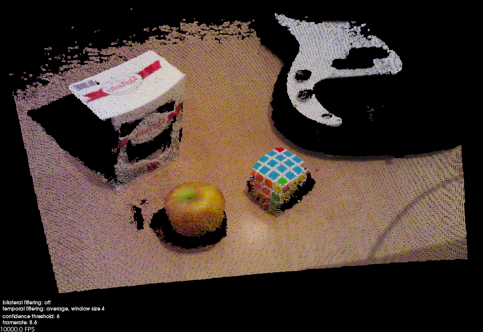

Requirements
============

1. Point Cloud Library 1.7.2

2. [Intel® RealSense™ SDK for Windows](https://software.intel.com/en-us/intel-realsense-sdk/download)

Installation
============

1. Clone this repository:

   ```bash
   git clone https://github.com/taketwo/rs.git rs
   cd rs
   ```

2. Configure the project:

   ```bash
   mkdir build
   cd build
   cmake -DBUILD_TYPE=Release ..
   ```

   Note: configuration process might fail if some of the required packages are
   not found. In this case it is convenient to use `cmake-gui` to manually
   specify locations.
   
   ```bash
   cmake-gui ..
   ```
   
   Press "Configure" and "Generate" after the locations have been specified.

3. Open the "rs.sln" solution file created in the previous step with Visual
   Studio. Press F7 to build the project.

Real Sense Viewer
=================

Connect a RealSense camera and run `real_sense_viewer.exe`.



Run with `--help` option to see the usage guide:

```
****************************************************************************
*                                                                          *
*                        REAL SENSE VIEWER - Usage Guide                   *
*                                                                          *
****************************************************************************

Usage: real_sense_viewer.exe [Options] device_id

Options:

     --help, -h : Show this help
     --list, -l : List connected RealSense devices
     --xyz      : View XYZ-only clouds

Keyboard commands:

   When the focus is on the viewer window, the following keyboard commands
   are available:
     * t/T : increase or decrease depth data confidence threshold
     * k   : enable next temporal filtering method
     * b   : toggle bilateral filtering
     * a/A : increase or decrease bilateral filter spatial sigma
     * z/Z : increase or decrease bilateral filter range sigma
     * s   : save the last grabbed cloud to disk
     * h   : print the list of standard PCL viewer commands

Notes:

   The device to grab data from is selected using device_id argument. It
   could be either:
     * serial number (e.g. 231400041-03)
     * device index (e.g. #2 for the second connected device)

   If device_id is not given, then the first available device will be used.
```